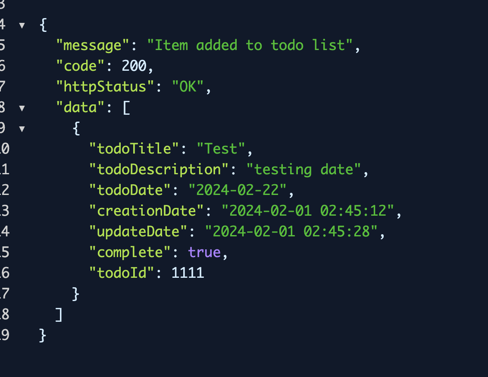

## Project Task app

### Tech used

<ul>
  <li>java</li>
  <li>spring boot</li>
  <li>React js</li>
  <li>Typescript</>
  <li>Postgresql</li>
</ul>

### I have used MVC architecture in the backend to develop the APIs. We have a model called Task and a few API endpoints that let you do crud operations in this model and the app is hosted in railway.app, the front end is powered by react and typescript hosted in vercel.com

## Thought process

### I started by creating a standard spring boot app and used documentation, chat gpt, anthropic Claudia etc to develop the program I was stuck in  generic CRUD operations for a few hours because of some error in dependency injection, but I was able to solve that and to make the response better I created a response class and did method overriding and made the class type compatible by using the generics. developing the frontend was easier for me since I have been working in React for few years i was able to create the frontend in a few hours , I used typescript for better dx and vanilla CSS

### For local development I used postgresql running inside a docker container as the database

* This is the first time I am writing a spring boot application, i have experience in writing nest js so this method of programming with decorators was familiar for me

### Running locally

* For Java, make sure you have installed java runtime mvn  then run <code>mvn spring-boot: run</code>

* For frontend install pnpm and run <code>pnpm run dev</code>
